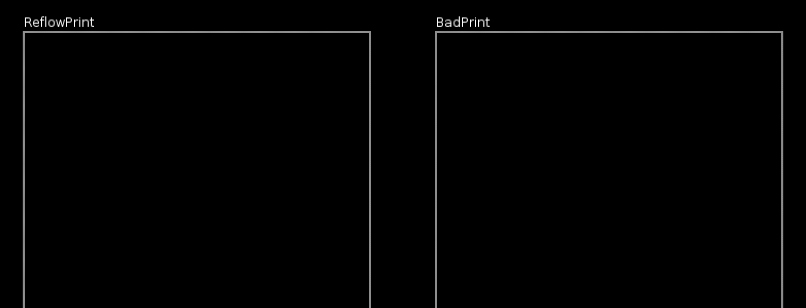

# ReflowPrint

ReflowPrint is a a library designed for alignment of text that is shown one character at a time.

This library is compatible with LÖVE 0.10.x and 11.0

This library is released under the MIT License